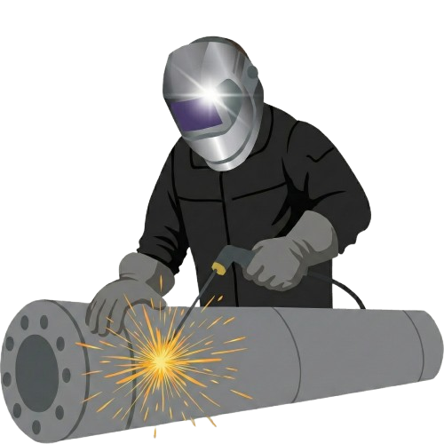

<!DOCTYPE html>
<html lang="en">
<head>
    <meta charset="UTF-8">
    <meta name="viewport" content="width=device-width, initial-scale=1.0">
    <title>MIG-TOP - Profesjonalne usługi spawalnicze</title>
    <link rel="stylesheet" href="style.css">
    <link rel="stylesheet" href="https://fonts.googleapis.com/css2?family=Material+Symbols+Outlined:opsz,wght,FILL,GRAD@20..48,100..700,0..1,-50..200" />
    
</head>
<body>
    

        

            
O NAS

            
UMIEJĘTNOŚCI

            
CERTYFIKATY

            
KONTAKT

        

        
MIG-TOP

    

    

        

            
O NAS

            

                Oferujemy kompleksowe spawanie metodami MIG/MAG oraz TIG. Specjalizujemy się w łączeniu stali czarnej, nierdzewnej i aluminium, gwarantując najwyższą precyzję oraz trwałość spoin dla przemysłu i klientów indywidualnych. Łączymy wieloletnie doświadczenie z nowoczesną technologią. Realizujemy zarówno skomplikowane konstrukcje stalowe, jak i precyzyjne naprawy
            

        

    

    

        </img>
    

    

        
UMIEJĘTNOŚCI

        

            <ul>
                <li>Biegłośc w spawaniu metodami MIG/MAG oraz TIG</li>
                <li>Czytanie rysunku technicznego</li>
                <li>Przygotowanie materiałów i obróbka wykończeniowa</li>
                <li>Znajomość materiałoznawstwa</li>
                <li>Kontrola jakości i przestrzeganie norm BHP</li>
            </ul>
        

    

    

        
CERTYFIKATY

        

            <ul>
                <li>Świadectwo Egzaminu Spawacza wg EN ISO 9606-1</li>
                <li>Certyfikat ASME Section IX</li>
                <li>Uprawnienia Ciśnieniowe PED</li>
                <li>Certyfikat Kompetencji NDT</li>
                <li>Certyfikat Bezpieczeństwa SCC / VCA</li>
            </ul>
        

    

    

    

        

            
KONTAKT

            

                <a href="tel:+48123456789">
phone_in_talk +48 123 456 789
</a>
                <a href="mailto:mig-top@gmail.com">
mail mig-top@gmail.com
</a>
            

        

        
© Wszystkie prawa zastrzeżone.

    

</body>
</html>
